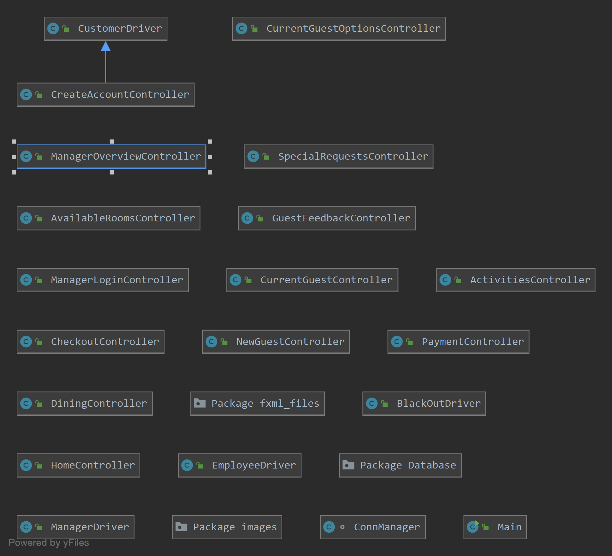
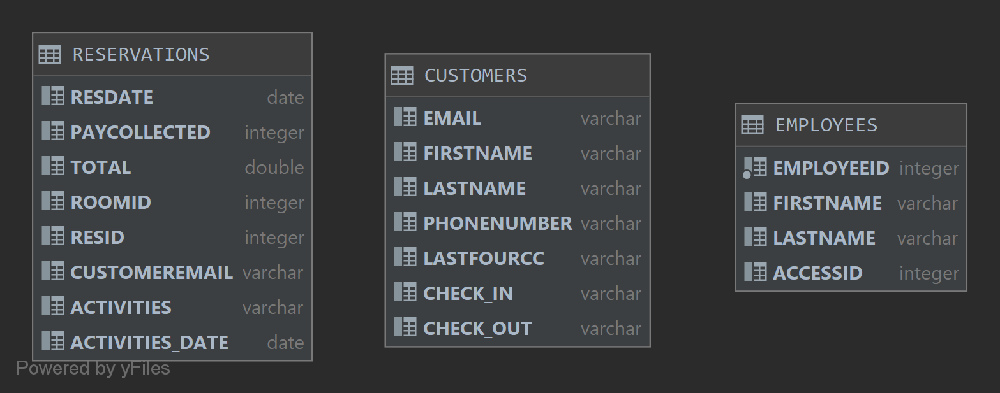

# Sandy Shores Resort

Project description: Sandy Shores Resort is a program for a resort/hotel that would be able to implemented into a resort and hospitality business. It allows for the following functions:

- The system shall allow customers to view available rooms at the resort for a date that they have selected.
- The system shall update the price of the rooms according to the date the customer has selected.
- The system shall gather the first name, last name, email address, phone number, reservation date, and credit card number from the customer and store them into a database.
- The system shall allow the customer the ability to a make a reservation to the resort on the date they have selected and the number of guests attending.
- The system shall confirm any and all resort reservations with the customer on the dates they have selected and the number of guests attending.
- The system shall allow for current resort guests to login to the system and view options for activities, special requests, dining, and guest feedback.
- The system shall allow for customers to request feather pillows, regular pillows, down comforters, or sheets from the main office.
- The system shall allow for customers to request shampoo, conditioner, body wash, lotion, hand towels, or bath towels from the main office.
- The system shall allow for customers to send a direct message to the main office and ask for additional requests.
- The system shall confirm with the customer any and all special requests that are sent to the main office.
- The system shall allow for customers to book water rental reservations on a date they have selected and the number of guests attending.
- The system shall allow for customers to book snorkeling tours on a date they have selected and the number of guests attending.
- The system shall confirm any and all booked rentals or tours that the customer requests.
- The system shall allow for customers to make reservations at the resort's dining options on a date they have selected and the number of guests attending.
- The system shall confirm any and all dining reservations that the customer requests.
- The system shall allow for customers to check out of their resort stay via the system.
- The system shall allow for customers to leave feedback to the managerial team about their stay at the resort.
- The system shall allow for a manager/employee to access financial records, customer information, blackout dates, employee records, and view customer feedback about the resort.
- The system shall allow for employees to view customer names, emails, reservation dates, phone number, and last four of the credit card on file for past, current, and future customers.
- The system shall allow for employees to view financial reports on dining, resort activities, room rates, expenses, and total revenue.
- The system shall allow for employees to view customer feedback about the resort.
- The system shall allow for employees to enter new employees into the database with their first name, last name, employee ID, and access ID.

Sandy Shores was produced by all teams members of Thursday, Group 1 as part of a group assignment for a Software Engineering Fundamentals course at Florida Gulf Coast University in Fort Myers, Florida.

#### Group and Group Members:

CEN 3031 Resort Project Thursday Group 1
- Andrew Cavallaro
- Joseph Cisar
- Elizabeth Gonzalez
- Shawn Hasten
- Daniel Miller

## Getting Started

- On the [home page](https://github.com/Acavallaro75/SandyShoresResort) of the Sandy Shores resort, select the clone or download drop-down menu and copy the URL displayed in that menu. Alternatively, the link is here for your convenience: https://github.com/Acavallaro75/SandyShoresResort.git.

- Once the link has been copied, open your Java IDE, preferably IntilliJ IDEA Ultimate Edition by JetBrains as that was what was used to produce the project, and select "Get from Version Control".

- Paste the copied URL into the field URL and choose where you would like to save this project and select clone.

- You will be prompted with a message asking if you would like to open the project. Select yes to view the project.

- A runnable jar has been made, so you should only need to go to the Main class in the resort package and press run to access the program.

- On the left side of the Main class select the green triangle and select "Run 'Main.main()'" and the program should run.

- The database also has been implemented with a jar file, so that should aslo work with no problems.

- For the manager login screen, the default username and password are Cavallaro and 512560, respectively.

- For the guest login screen, the default last name and phone number are Cavallaro and 6629984, respectively.

## Documentation

#### JavaDoc:

- [JavaDoc](https://acavallaro75.github.io/SandyShoresResort/index.html)

#### Project Setup:

- [Project Setup](https://drive.google.com/open?id=1lfS6IWl4w93qnfdubguOHzA8Cco3e4SJ)

#### Initial Use Case Diagram:

- [Initial Use Case Diagram](https://drive.google.com/open?id=1V__t1IfBsPuiqwV9d8YnLm9Ah3PzHnLE)

## Diagrams

#### Class Diagram:

#### Database Visualization:

## Project Features

#### Home Page:

- Used to create the first page that a user sees
- The user can choose one of three options: book now, current guest, and manager login

#### New Guest Page:

- Used to gather the check in and check out dates from the user as well as the number of guests that will be coming on the trip
- Error handling to check if the dates are null or if the checkout date is before the checkin date
- The prices will fluctuate based on the dates the user has chosen
- The submit button will display the available rooms to the user

#### Available Rooms Page:

- Used to display the rooms that are available to the user for their requested stay
- Displays the appropriate price, amenities, and a photo of the room
- The price of the room will depend on the dates chosen for the reservation
- The book button will bring the user to a page to create an account before asking for payment 

#### Create Account Page:

- Used to gather the users information and stores it into the database
- The following information is gathered from the user: first name, last name, email, phone number, check in date, and check out date
- If any of the fields are left blank or not in the correct form, an error message will be displayed to the user
- After the user information has been added, the user will continue to the payment page.

#### Payment Page:

- Used for the user to enter their credit card information into the database
- When information has been entered incorrectly an error message will be displayed
- If all of the information is entered correctly, a confirmation message will appear that the user must select before the reservation is set

#### Current Guest Page:
The CurrentGuestController and current_guest.fxml files are used to compare the guest's last name and phone number entered into the text fields to match the database records to verify that they are indeed a guest and can book activities, dinner reservations, and special requests. The default values currently are Cavallaro and 6629984 for last name and phone number.

#### Current Guest Options Page:

- Used to give the guest four choices to choose from: activities, special requests, dining, and checkout

#### Activities Page:

- Used to display the available options to the customer as far as activities are concerned
- The user can select the date and number of guests that will be present and can book their activity
- If the date or number of guests is not set, the user will be shown an error message
- If both fields are set by the user, a confirmation message will appear and verify the activity, date, and number of guests

#### Special Requests Page:

- Used to display the available options to the customer as far as special requests are concerned
- The user can choose from the list of options and the quantity that they are requesting
- The user will be greeted with a confirmation that confirms their selection and the quantity
- If a message is sent to the front desk, the user will be shown a confirmation message confirming their message has been received and will display their message back to them for correctness

#### Dining Page:

- Used to display the available options for dining to the customer
- The user can select the date and number of guests that will be present and can book their dining reservation
- If the date or number of guests is not set, the user will be shown an error message
- If both fields are set by the user, a confirmation message will appear and verify the restaurant, date, number of guests, and a thank you from the resort

#### Checkout Page:

- Used for the customer to check out of the resort and to leave a review of the resort which can be read on the manager overview page

#### Manager Login Page:

-Used to gather the username and password of an employee and cross reference them with the database to verify that they are indeed an employee
- If the values entered do not match the database, the user is met with an error message
- If correct, the user will be granted access to the manager overview page
- The default values currently are Cavallaro and 512560 for username and password

#### Manager Overview Page

- Used to display all the data to the employee
- The employee can see financial reports from past and present, make blackout dates, view customer information, view customer feedback, view and create employee access, and exit the manager overview page by clicking the exit button that will bring them to the home page.

## Contributions

- Edited by: Andrew Cavallaro on 10/20/2019
- Edited by: Joseph Cisar on 11/30/2019
- Edited by: Andrew Cavallaro on 12/04/2019
